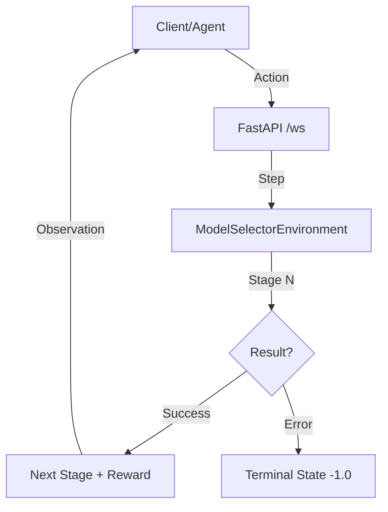
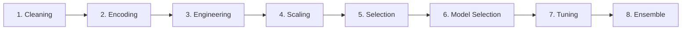

# 🤖 Model Selector: 8-Stage AutoML Environment

A professional, production-ready AutoML pipeline environment built for **OpenEnv**. This environment orchestrates a sophisticated 8-stage machine learning workflow, transforming raw data into optimized ensemble models.

[](https://github.com/meta-pytorch/OpenEnv)
[](https://github.com/boopathi-376/RL-Driven-AutoML)
[](https://www.python.org/downloads/)
[](https://opensource.org/licenses/BSD-3-Clause)

## 📋 Table of Contents
- [System Architecture](#-system-architecture)
- [Pipeline Workflow](#-pipeline-workflow)
- [Project Structure](#-project-structure)
- [Getting Started](#-getting-started)
- [Environment Specification](#-environment-specification)
- [Deployment](#-deployment)
- [Inference & Usage](#-inference--usage)

---

## 🏗 System Architecture

The Model Selector follows a stateful environment-agent architecture. The **Environment** (Server) maintains the dataset and pipeline state, while the **Agent** (Client) decides which action to take at each of the 8 sequential stages.



---

## ⚙️ Pipeline Workflow

The environment strictly enforces an 8-stage progression. Each stage must be successfully completed to earn a positive reward and move to the next.



### 1. 🧹 Data Cleaning (`DataCleaner`)
- Handles missing values (median/mode/constant).
- Detects and clips outliers using IQR.
- Removes duplicates and standardizes column names.
- Lowercases and cleans text features.

### 2. 🔤 Data Encoding (`DataEncoder`)
- Automatic detection of categorical, numerical, and text columns.
- One-Hot/Ordinal encoding for categories.
- TF-IDF/Hashing vectorization for text data.

### 3. ⚙️ Feature Engineering (`FeatureEngineer`)
- Generates polynomial features.
- Creates manual interaction terms (e.g., $X_1 \times X_2$).
- Extracts datetime features (hour, day, month, etc.).

### 4. 📏 Feature Scaling (`DataScaler`)
- Standard, Min-Max, and Robust scaling options.
- Intelligent handling of sparse matrices to preserve memory.

### 5. 🎯 Feature Selection (`FeatureSelector`)
- Variance-based filtering.
- Univariate selection (SelectKBest).
- Importance-based pruning using Random Forest.

### 6. 🤖 Model Selection (`SmartModelSelector`)
- Heuristic-driven model selection based on sample count and feature density.
- Cross-validated performance baselines.
- Supports Classification (Logistic, SGD, DT, RF, MNB) and Regression (Linear, SGD, RF).

### 7. 🔧 Hyperparameter Tuning (`HyperparamTuner`)
- Automated search across model-specific parameter grids.
- Cross-validation integrated scoring.

### 8. 🧩 Ensemble Building (`EnsembleBuilder`)
- Voting and Stacking strategies.
- Combines top-performing models for maximum stability.

---

## 📁 Project Structure

```text
model_selector/
├── server/
│   ├── steps_8/                 # Stage-specific modules
│   │   ├── data_cleaning.py
│   │   ├── encoding.py
│   │   ├── feature_engineering.py
│   │   ├── scaling.py
│   │   ├── feature_selection.py
│   │   ├── model_selection.py
│   │   ├── hyperparameter_tuning.py
│   │   └── ensemble.py
│   ├── app.py                   # FastAPI Server entry point
│   └── model_selector_environment.py # Core Environment Logic
├── data/                        # Sample datasets (SAR, Wine, etc.)
├── models.py                    # Action & Observation Pydantic models
├── client.py                    # OpenEnv WebSocket Client
├── inference.py                 # Agent-driven pipeline execution script
├── Dockerfile                   # OpenEnv compliant container build
├── openenv.yaml                 # Environment manifest
└── pyproject.toml               # Dependency specification
```

---

## 🚀 Getting Started

### Prerequisites
- Python 3.10+
- [uv](https://github.com/astral-sh/uv) (recommended) or pip

### Installation
```bash
# Clone the repository
git clone https://github.com/your-repo/model_selector.git
cd model_selector

# Install dependencies
uv sync
```

### Running Locally
```bash
# Start the FastAPI server
uv run server

# In a separate terminal, run the agent-driven inference
uv run python inference.py
```

---

## 🧪 Deployment

### Docker Build
The environment is fully containerized and follows [OpenEnv criteria](https://github.com/meta-pytorch/OpenEnv).

```bash
docker build -t model_selector:latest .
docker run -p 8000:8000 model_selector:latest
```

### Hugging Face Spaces
Deploy instantly using the OpenEnv CLI:
```bash
openenv push --repo-id your-org/model-selector-space
```

---

## 📡 Inference & Usage

### Direct Environment Access
You can interact with the environment via the `ModelSelectorEnv` client:

```python
from client import ModelSelectorEnv
from models import ModelSelectorAction

with ModelSelectorEnv(base_url="http://localhost:8000") as env:
    # 1. Reset with dataset config
    obs = env.reset(params={
        "data_path": "./data/winequality-red.csv",
        "target_column": "quality"
    })
    
    # 2. Step through stages
    action = ModelSelectorAction(stage_config={"strategy": "median"})
    obs = env.step(action)
    print(f"Current State Reward: {obs.reward}")
```

### Automatic Agent Inference
The `inference.py` script demonstrates how to drive the pipeline using an LLM (like Qwen-72B) to make strategic configuration decisions at each stage.

---

> [!NOTE]
> This environment is designed to be extensible. To add a new stage, simply add a module to `server/steps_8/` and register it in `ModelSelectorEnvironment`.
