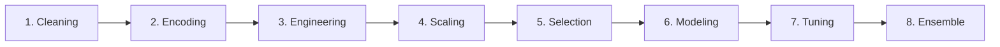

# 🧠 RL-Driven AutoML: An Intelligent ML Model Selector

[](https://github.com/meta-pytorch/OpenEnv)
[](https://github.com/boopathi-376/RL-Driven-AutoML)
[](https://huggingface.co/spaces/boopathi-376/RL-Driven-AutoML)

**RL-Driven AutoML** is an interactive environment designed for the **OpenEnv** ecosystem. Unlike static AutoML tools that output a single recommendation, this project treats the machine learning workflow as a **Sequential Decision Process**. It enables Reinforcement Learning (RL) agents to interact with datasets, perform strategic actions (cleaning, encoding, selecting), and receive rewards based on their ability to build high-performing, efficient pipelines.

---

## 🌟 The Core Concept: "The Virtual ML Engineer"

Traditional AutoML takes an input and returns an output. **RL-Driven AutoML** simulates the human workflow through a structured pipeline. At each stage, the agent makes a strategic decision:

1.  **Observe**: Dataset metadata, distributions, and statistics.
2.  **Decide**: Select the next processing step (e.g., *"Should I use Polynomial Features?"*).
3.  **Execute**: Apply the action and observe the transformation.
4.  **Evaluate**: Measure final model performance vs. resource usage (latency/memory).
5.  **Learn**: Optimize the strategy for future unseen datasets.

---

## 🛤️ The Intelligent Pipeline Workflow

For structured data, the environment enforces an 8-stage "Sequential Decision Process". For raw text data, it automatically simplifies to a 4-stage specialized text pipeline.



---

## 🏗️ Environment Architecture

```text
                ┌──────────────────────┐
                │     RL Agent         │
                │ (Decision Maker)     │
                └──────────┬───────────┘
                           │
                      Action (JSON)
                           │
                           ▼
    ┌──────────────────────────────────────────────────┐
    │         OpenEnv Environment (FastAPI)            │
    │  ────────────────────────────────────────────    │
    │                                                  │
    │  ┌──────────────────────────────────────────┐   │
    │  │      FastAPI /step Endpoint              │   │
    │  └──────────────────┬───────────────────────┘   │
    │                     │                           │
    │         ┌───────────▼──────────┐                │
    │         │   State Manager      │                │
    │         │  (Pipeline Tracker)  │                │
    │         └───────┬──────────┬───┘                │
    │                 │          │                    │
    │         ┌───────▼────┐ ┌───▼──────┐             │
    │         │Data Engine │ │Reward    │             │
    │         │(Processing)│ │Engine    │             │
    │         └───────┬────┘ │(Scoring) │             │
    │                 │      └───┬──────┘             │
    │         ┌───────▼────┐    │                     │
    │         │Internal    │────┘                     │
    │         │State       │                          │
    │         └───────┬────┘                          │
    │                 │                               │
    │         ┌───────▼──────────┐                    │
    │         │Observation       │                    │
    │         │Generator         │                    │
    │         └───────┬──────────┘                    │
    └─────────────────┼──────────────────────────────┘
                      │
                Observation + Reward
                      │
                      ▼
                ┌──────────────────┐
                │    RL Agent      │
                │  (Learns Policy) │
                └──────────────────┘
```

---

## 🛰️ API Endpoints

| Endpoint | Method | Description |
|----------|--------|-------------|
| `/reset` | `POST` | Start a new episode with a fresh dataset |
| `/step` | `POST` | Execute a pipeline action and get observation + reward |
| `/state` | `GET` | Get detailed internal state (progress, stages, metadata) |
| `/docs` | `GET` | Interactive Swagger/OpenAPI documentation |
| `/ws` | `WSS` | Persistent WebSocket session for low-latency agent interaction |

---

## 🛠️ RL Environment Specifications

### 📊 Observation Space
```json
{
  "stage": "encoding",
  "task_type": "classification",
  "dataset_profile": {
    "n_samples": 1000,
    "n_features": 25,
    "missing_values": 120
  },
  "progress": 0.25,
  "reward": 0.74
}
```

### 🏆 Reward System
Rewards are calculated dynamically based on:
`Reward = Val_Score + (0.2 × Improvement) - (0.3 × Overfit_Gap) - Latency_Penalty`

| Scenario | Reward Signal | Reason |
|----------|---------------|--------|
| **Optimal Selection** | +0.85 to +1.0 | High validation accuracy matching task type |
| **Overfitting** | -0.40 | Large gap between Training and Validation scores |
| **Heavy Model** | -0.15 | High computation time / latency penalty |
| **Binary Skip** | +0.05 | Correctly skipping redundant steps (e.g. scaling for Trees) |

---

## 🚀 Getting Started

### 1. Clone & Install
```bash
git clone https://github.com/boopathi-376/RL-Driven-AutoML.git
cd RL-Driven-AutoML
uv sync
```

### 2. Run the Server
```bash
uv run server
```

### 3. Run the Agent (Inference)
```bash
# Requires HF_TOKEN or API_KEY env variable
uv run python inference.py
```

---

## 📂 Project Structure

```text
RL-Driven-AutoML/
├── server/
│   ├── steps_8/        # Core ML Processing Engine
│   ├── app.py          # FastAPI Server Scaffolding
│   └── model_selector_environment.py # Environment Logic
├── data/               # Benchmark Datasets (CSV/TXT)
├── models.py           # Pydantic Action/Observation schemas
├── client.py           # OpenEnv WebSocket Client
├── inference.py        # LLM-based Agent Reference Implementation
├── openenv.yaml        # environment manifest
└── Dockerfile          # Container configuration
```

---

## 🤝 Contributing
We welcome contributions! Please fork the repository and open a Pull Request for any feature additions or optimizations.

## 🔮 Future Roadmap
- [ ] **Multi-Agent Collaboration** — Separate agents for Data Cleaning vs. Modeling.
- [ ] **Explainable AI** — Agent provides text reasoning for its actions.
- [ ] **Optuna Integration** — Advanced Bayesian hyperparameter search.
- [ ] **Visualization Dashboard** — Real-time training monitoring.
